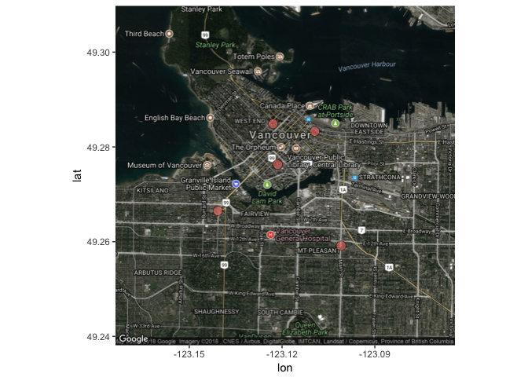

# Yelp API   
   
[](https://travis-ci.org/vinverguan/yelpitout)     
     
### Project contributors:

1. [Yinghua Guan](https://github.com/vinverguan)
2. [Ying Dong](http://github.com/yvonnedy)
3. [Ruoqi Xu](https://github.com/rq1995)
4. [Longlingzi Yao](https://github.com/yllz)

### Introduction

Our package intends to explore ...

### To install please execute the following in `R`:

`devtools::load_all()`

`devtools::install_github("vinverguan/yelpitout")`

### How to use:

Usage: `search_cat(category, location)`  
Input: 

- `category`: a string representing the category of business
- `location`: a city name

Output: a data frame containing names, ratings and price levels

Example:

```
search_cat("Chinese", "Vancouver")
```

--

Usage: `phone_number(business)`  
Input: 

- `business`: a string representing the name of the business

Output: a string of the phone number

Example:

```
> phone_number("Soirette")
"(604)558-3308"
```


--

Usage: `location_map(yelp_key, category, city)`  
Input:   

- `yelp_key`: a string representing a Yelp API key
- `category`: a string representing the category of business
- `city`: a city name

Output:  a google map including locations of the top 5 businesses (ordered by review count)

Example:

```
> location_map("your_yelp_key"", "cafe", "Vancouver")
```


--


Usage: `delivery_list(yelp_key, location, order)`  
Input:   

- `yelp_key`: a string representing a Yelp API key
- `location`: a string representing the delivery location, prefer zipcode
- `order`: a string representing the outcome order method, order include 3 choice: *Price*, *Rating*, *Review_number*

Output:  a data frame of max 20 restaurant that can deliver to a selected address based on selected order

Example:

```
> delivery_list(my_key, "98104", "Rating")
```
