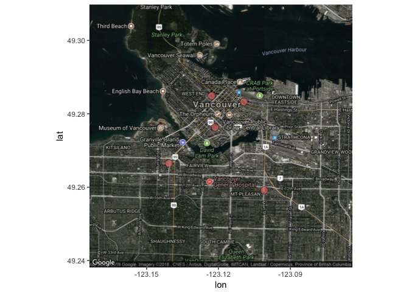

```{r setup, include = FALSE}
knitr::opts_chunk$set(
  collapse = TRUE,
  comment = "#>"
)
```

## Introduction

Our package `yelpitout` intends to develop an R wrapper for the Yelp RESTful API.

The package provides users with three different methods to look for businesses they desire on Yelp. First, find businesses by category and location. Second, match business data by using its name on Yelp. Third, search for businesses which support food delivery transactions.

The package includes four functions. The first function `search_cat()` returns some basic information about 50 businesses based on provided category and location. `location_map()` uses the same search criteria but produces a google map visualization of the top 5 businesses ordered by review count. `name_match()` is able to return 1 business that is the best match based on name and location provided. And the last one `delivery_list()` returns up to 20 businesses that can deliver to a provided location ordered by a specified order. 
     
## Function 1

```
search_cat(yelp_key, category, city)
```

**Parameters:**

* **yelp_key (str)**: -- a Yelp API key

* **category (str)**: -- a category of business 
            
* **city (str)**: -- a city name    

**Return:**

* a dateframe containing name, rating, review count of 50 businesses

## Example 1

```
> search_cat(Sys.getenv("yelp_key"), "cafe", "Vancouver")
```     

| name | rating | review_count| 
| --- | -------- | -------- | 
| Revolver | 4.5 | 437 | 
| ... | ... | ... | 
| Le Marche St. George | 4 | 132 | 

## Function 2

```
location_map(yelp_key, category, city)
```

**Parameters:**

* **yelp_key (str)**: -- a Yelp API key

* **category (str)**: -- a category of business 
            
* **city (str)**: -- a city name

**Return:**

* a google map including locations of the top 5 businesses (ordered by review count)

## Example 2

```
> location_map(Sys.getenv("yelp_key"), "cafe", "Vancouver")
```    


   
## Function 3

```
name_match(key, name, city, state, country)
```

**Parameters:**

* **key (str)**: -- a Yelp API key

* **name (str)**: -- the name of a business 
            
* **city (str)**: -- a city name    
   
* **state (str)**: -- a state code    
   
* **country (str)**: -- a country code

**Return:**

* a dateframe containing name, phone, location and postal code of a business that is the best match

## Example 3

```
> name_match(Sys.getenv("yelp_key"), "Starbucks", "Burnaby", "BC", "CA")
```     

| Name | Phone | Location | Postal Code |
| --- | -------- | -------- | -------- |
| Starbucks | +16042931325 | 4461 Lougheed Hwy | V5C 3Z6 |         
              
## Function 4

```
delivery_list(yelp_key, location, order)
```

**Parameters:**

* **yelp_key (str)**: -- a Yelp API key

* **location (str)**: -- a delivery location, prefer zipcode 
            
* **order (str)**: -- the outcome order method

**Return:**

* a dataframe of max 20 restaurant that can deliver to a provided location based on the selected order

## Example 4

```
> delivery_list(Sys.getenv("yelp_key"), "98104", "Rating")
```    
    
| Restaurant | Price | Rating | Review_number | Phone_number |
| -------- | --- | -------- | -------- | -------- |
| Jars Juice | $ | 4.5 | 106 | (206)249-5988 | 
| ... | ... | ... | ... | ... | 
| Happy Garden | $$ | 2.5 | 60 | (206)621-8656 | 
                
                    
                       
                          
                             
                             
